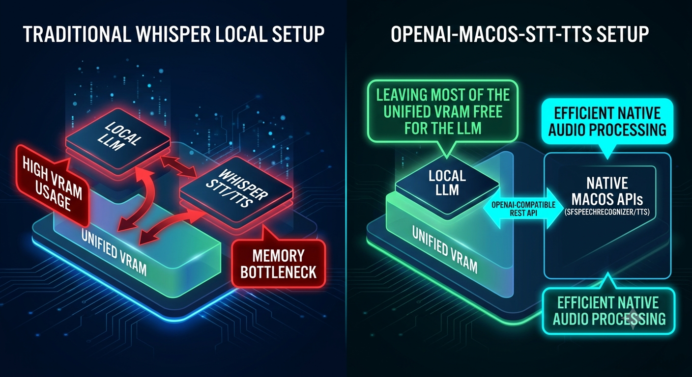
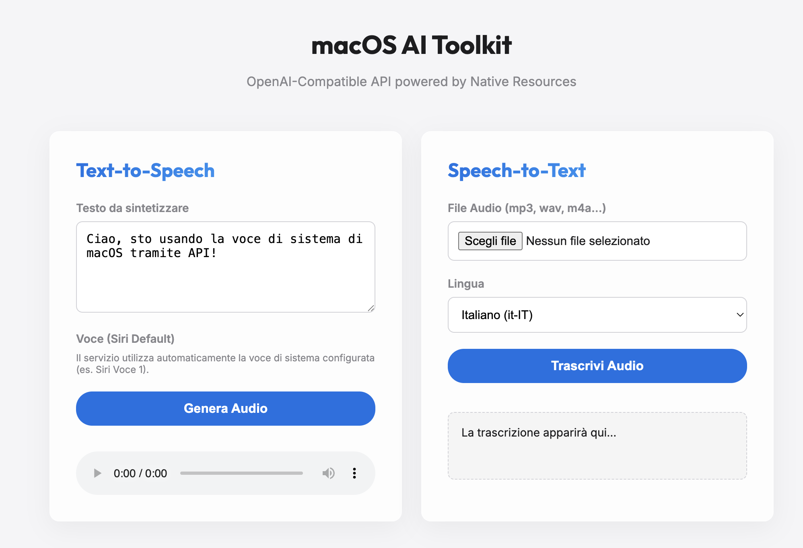

# Zero RAM Tax: Native macOS STT/TTS Behind an OpenAI-Compatible API



## The Problem

Running local LLMs (Llama 3, Qwen, Mistral, etc.) already pushes RAM and VRAM to the limit. Adding Whisper on top of that often becomes the final straw.

A typical `whisper-large-v3` or even a quantized medium model can easily consume **2–6 GB of memory** (and significant GPU/ANE resources). When you also want real-time or near-real-time speech-to-text and text-to-speech in the same pipeline, the system starts swapping, latency spikes, or the LLM context window has to be artificially reduced.

Most people end up with one of these compromises:

- **Run Whisper only when the LLM is idle**
- **Offload STT/TTS to the cloud** (privacy and latency trade-offs)
- **Accept that voice features are “nice to have”** rather than always-on

On a Mac, this feels particularly wasteful. Apple already ships high-quality, hardware-accelerated speech recognition (`SFSpeechRecognizer`) and a mature TTS engine (`say` + system voices). Both run with almost zero additional memory footprint and leverage the Neural Engine / system frameworks efficiently.

The missing piece was a clean, drop-in OpenAI-compatible API so existing tools (Open WebUI, SillyTavern, custom agents, Home Assistant, etc.) could talk to these native services without code changes.


## The Architecture

The solution is deliberately minimal:

```text
┌─────────────────────┐
│  Any OpenAI client  │
│ (Open WebUI, etc.)  │
└──────────┬──────────┘
           │  /v1/audio/speech
           │  /v1/audio/transcriptions
           ▼
┌─────────────────────┐
│  Flask API Server   │  ← OpenAI-compatible façade
│  (app.py)           │
└──────────┬──────────┘
           │
     ┌─────┴─────┐
     │           │
     ▼           ▼
┌─────────┐  ┌──────────────────────┐
│  say    │  │  macos-transcribe    │
│ (TTS)   │  │  (Swift +            │
│         │  │   SFSpeechRecognizer)│
└─────────┘  └──────────────────────┘
     │                   │
     └─────────┬─────────┘
               ▼
        Native macOS
     (zero extra model RAM)
```

### Requirements

To run the project you need:

- **macOS 14 Sonoma or later** (tested primarily on Sonoma and newer)
- **Python 3.8+**
- **ffmpeg** (install with `brew install ffmpeg`)
- **Xcode Command Line Tools** (`xcode-select --install`) — required to compile the Swift `macos-transcribe` binary
- A working Swift toolchain (comes with the Command Line Tools / Xcode)

**Permissions**

The first time you use Speech-to-Text, macOS will ask for **Speech Recognition** permission.  
Go to **System Settings → Privacy & Security → Speech Recognition** and make sure the terminal (or the process running `macos-transcribe`) is allowed.

The Swift tool forces **on-device recognition** (`requiresOnDeviceRecognition = true`), so no audio leaves your Mac.

**Hardware compatibility**

The project works on both **Apple Silicon** and **Intel** Macs.  
On Intel machines it requires **macOS Tahoe (26)**.

### The “no `-v`” trick for higher-quality TTS

A small but important detail in the TTS implementation:

```python
say_cmd = ['say', '-o', temp_aiff]
# deliberately NO -v flag
say_cmd.extend(['-r', str(wpm)])
say_cmd.append(text)
```

By **not** passing the `-v` (voice) parameter, `say` falls back to the **system default voice**.

This is intentional. If you set the system voice to **Siri Voice 1** (the highest-quality neural voice) in:

**System Settings → Accessibility → Spoken Content → System Voice**

…you automatically get the best synthesis quality macOS can offer, without having to maintain a complex mapping of “Enhanced / Premium” voices that can change between macOS versions.

The voice mapping in `config.py` is still present for future flexibility, but the current default path prefers the system voice for maximum quality and simplicity.

### Key design decisions

- **TTS** → Shell out to the system `say` command, then convert the resulting AIFF to the requested format with `ffmpeg`.
- **STT** → A small Swift CLI (`macos-transcribe`) that uses Apple’s `SFSpeechRecognizer`. Audio is normalized to 16 kHz mono WAV. Files longer than ~15 seconds are automatically chunked (Apple’s recognizer has an empirical ~16 s limit per recognition request), processed sequentially, and reassembled. Long jobs return a `job_id` (HTTP 202) with a polling endpoint.
- **Everything stays local.** No model weights are loaded by the service itself.

The result: STT and TTS become essentially **free** from a memory perspective while the heavy LLM can keep all the RAM/VRAM it needs.

## Code & Result

Configuration is intentionally simple. Voice mapping lives in `config.py` (kept for future flexibility):

```python
VOICE_MAPPING = {
    'alloy': 'Alice (Enhanced)',
    'echo': 'Luca (Enhanced)',
    'nova': 'Emma (Premium)',
    'onyx': 'Fred',
    'shimmer': 'Zoe (Premium)',
    'fable': 'Samantha',
    'default': 'Alice'
}

LANG_VOICE_MAPPING = {
    'it': 'Alice (Enhanced)',
    'en': 'Samantha',
    'fr': 'Thomas',
    'de': 'Anna',
    'es': 'Monica'
}
```

A minimal `.env` controls the server:

```bash
PORT=5050
HOST=0.0.0.0
USE_HTTP=True          # recommended for local / Home Assistant use
FFMPEG_BIN=/opt/homebrew/bin/ffmpeg
# MACOS_TRANSCRIBE_BIN=./macos-transcribe/.build/arm64-apple-macosx/release/macos-transcribe
```

Typical usage looks exactly like the official OpenAI endpoints:

```bash
# TTS
curl -X POST http://localhost:5050/v1/audio/speech \
  -H "Content-Type: application/json" \
  -d '{"input": "Hello, I am your Mac speaking!", "voice": "nova", "speed": 1.1}' \
  --output speech.mp3

# STT (short file)
curl -X POST http://localhost:5050/v1/audio/transcriptions \
  -F "file=@recording.wav" \
  -F "language=en-US"

# Long audio → async job
curl -X POST http://localhost:5050/v1/audio/transcriptions \
  -F "file=@long_interview.mp3" \
  -F "language=it-IT"
# → {"job_id": "..."}

curl http://localhost:5050/v1/audio/transcriptions/<job_id>
```

The service also exposes `/v1/voices` so clients can discover the available mappings.

### Web Client (Quick Testing UI)



Alongside the API server there is a minimal but practical web client located in the `web-app/` folder.

It is a small Node.js + Express application that acts as a thin proxy and provides a clean browser interface for testing both TTS and STT without writing curl commands every time.

**Features:**

- Simple form to generate speech (text → audio) using the native macOS voices
- File upload for transcription with language selection
- Real-time progress bar for long audio files (the ones that trigger automatic chunking)
- Automatic handling of the async job polling so you can see chunk-by-chunk progress
- Respects the same `USE_HTTP` / HTTPS settings as the main API server

**How to start it:**

```bash
cd web-app
npm install
npm start
```

Then open `http://localhost:3000` (or the HTTPS equivalent if you are not using `USE_HTTP=True`).

It is intentionally lightweight — just enough to verify that the OpenAI-compatible endpoints work correctly and to debug long transcriptions without leaving the browser.

### Repository

**GitHub:** [https://github.com/emme99/openai-macos-stt-tts](https://github.com/emme99/openai-macos-stt-tts)

It includes:

- The Flask API server
- The Swift `macos-transcribe` tool (needs a one-time `swift build -c release`)
- A small web tester with progress bar for long transcriptions
- Full English and Italian READMEs

## Takeaway

If you already run local models on a Mac, there is rarely a good reason to pay the “Whisper memory tax” for everyday STT/TTS. Apple’s native engines are fast, private, and essentially free from a resource standpoint. Wrapping them behind the familiar OpenAI audio endpoints removes the integration friction.

The project is deliberately small and focused. It does one job well: **give your local LLM stack high-quality voice I/O without stealing RAM or VRAM.**

*MIT licensed. Feedback and PRs welcome.*

